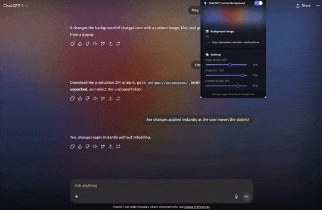

# ChatGPT Customizer Extension

This extension keeps the stylish GPT-5 landing page background visible even after you send a message, letting you enjoy the design while chatting. You can fully customize it in real time, adjust the blur level, choose your own background image, and tweak the gradient to your liking. Built quickly without prior extension experience, simple to use and open for anyone to improve or expand.

It also lets you enhance the ChatGPT experience with productivity features, like collapsible messages that clean up your chats.



## Features

### 🎨 **Background Customization**
- **Custom Background Images** - Use any image URL or the original GPT-5 background
- **Real-time Opacity Control** - Adjust background transparency
- **Dynamic Blur Effects** - Add blur for better text readability
- **Gradient Overlays** - Customize gradient opacity for perfect balance
- **Theme Adaptation** - Automatically adapts to light/dark mode

### 📝 **Message Management**
- **Collapsible Messages** - Click to collapse/expand individual messages. You can achieve this by pressing new "▼" buttons that appear on each message, or by `Alt+Clicking` in a message.
- **Master Toggle** - One-click button to collapse/expand all messages. Achievable also with `Alt+Shift+C`.
- **Persistent State** - Messages stay collapsed/expanded between sessions and chats.
- **Variable size** - Adjust the size of collapsed messages.
- **Customization** - Most of this options can be enabled or disabled in the options menu.

## Installation

1. **Download** the latest release from [GitHub Releases](https://github.com/diegomarzaa/chatgpt-customizer-extension/releases/latest)
2. **Extract** the ZIP file to a local folder
3. **Open** your browser (Chrome, Brave, Edge, etc.)
4. **Navigate** to `chrome://extensions/`
5. **Enable** "Developer mode" (toggle in top-right corner)
6. **Click** "Load unpacked"
7. **Select** the extracted folder
8. **Visit** [ChatGPT](https://chatgpt.com) and click the extension icon to configure

### **Default Background Image**

To use the original GPT-5 background, paste this URL:
```
https://persistent.oaistatic.com/burrito-nux/1920.webp
```

## **For Developers**

### **Requirements**
- Node.js 18+
- npm/pnpm package manager
- Basic TypeScript/React knowledge

### **Development Setup**
```bash
git clone https://github.com/diegomarzaa/chatgpt-customizer-extension
cd chatgpt-customizer-extension
npm install
```

### **Development Commands**
```bash
# Development with auto-reload
npm run dev

# Production build
npm run build

# Create distributable ZIP
npm run build -- --zip
```

### **Project Structure**
```
├── content.ts          # Main content script
├── popup.tsx           # Extension popup UI
├── collapsible-messages.ts  # Message collapse functionality
└── assets/            # Icons and demo files
```

## **Privacy & Security**

- **Local Storage Only** - All settings stored in `chrome.storage.local`
- **No External Servers** - No data transmitted anywhere
- **ChatGPT Only** - Extension only activates on chatgpt.com
- **Open Source** - Full code available for review
- **No Tracking** - Zero analytics or user tracking

## 📝 **Changelog**

### **v2.0.0** - *Major Feature Release*
- **Complete rebrand** from "ChatGPT Background Styling" to "ChatGPT Customizer"
- **Collapsible Messages** - Click triangle buttons to collapse/expand any message
- **Keyboard Shortcuts** - Alt+Shift+C for all messages
- **Alt+Click Support** - Hold Alt and click any message to toggle (optional)
- **Persistent State** - Messages stay collapsed/expanded between sessions and reloads

### **v1.0.2** - *Initial Release*
- **Background Customization** - Custom images, opacity, blur, gradients, in real time, with automatic light/dark mode adaptation.

## 🙏 **Acknowledgments**

- Built with [Plasmo Framework](https://plasmo.com)
- Inspired by the ChatGPT community