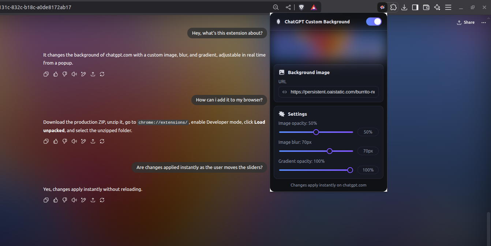

# ChatGPT Custom Background



Customize the background of chatgpt.com with image, blur, and gradient. Configurable in real-time from the popup.

## Installation

1. Download the ZIP of the extension in [this link](https://github.com/diegomarzaa/chatgpt-background-styling/releases/latest).
2. Unzip the file to a local folder.
3. In your browser (Chrome, Brave, Edge):
   - Navigate to `chrome://extensions/`
   - Enable **Developer mode** (toggle in top-right)
   - Click **Load unpacked**
   - Select the unzipped folder
   - Activate the extension
4. It will now work immediately on `chatgpt.com`.

## Usage

1. Open `https://chatgpt.com/`.
2. Click on the extension icon.
3. Adjust:
	- **Enable** on/off
	- **Image URL**
	- **Image Opacity**
	- **Blur (px)**
	- **Gradient Opacity**
4. Changes are applied **instantly** without reloading.

## For Developers

### Requirements

- Node.js v18+  
- npm or pnpm/package manager

### Workflow

```bash
git clone https://github.com/diegomarzaa/chatgpt-background-styling
cd chatgpt-background-styling
npm install
```

- For development (auto-reload):
```
npm run dev
```

- For production build & ZIP:
```
npm run build -- --zip
```

Reload extension after changes to reflect updates.

## Privacy

- Configuration stored in `chrome.storage` locally.
- No data is sent to external servers.

## Troubleshooting

- **Popup not showing**: make sure you have an active tab on `chatgpt.com`.
- **White border of the popup**: Couldn't be removed. Any help with this is appreciated.